# 👁️ Advanced Driver Drowsiness Detection System


> **"Technology that watches over you, so you can watch the road."**

---

<div align="center">

## 🌟 The Visionary Creator

This cutting-edge safety solution was **concepted, architected, and engineered solely by**:

# **SARAJI**

With a passion for saving lives through code, **Saraji** has pushed the boundaries of Computer Vision and Real-Time AI to create a system that is not just a tool, but a guardian. 

*"I built this system to ensure that every journey ends safely. By leveraging the power of Artificial Intelligence, we can detect the unseen danger of fatigue before it's too late."* - **Saraji**

</div>

---

## 📖 Table of Contents

1. [🚀 Project Overview](#-project-overview)
2. [🧠 Technical Deep Dive & Architecture](#-technical-deep-dive--architecture)
3. [🔢 Mathematical Foundation (EAR)](#-mathematical-foundation-ear)
4. [📱 Progressive Web App (PWA) Engineering](#-progressive-web-app-pwa-engineering)
5. [📂 Project Structure](#-project-structure)
6. [🛠️ Installation & Setup](#-installation--setup)
7. [💻 Usage Guide](#-usage-guide)
8. [🔮 Future Roadmap](#-future-roadmap)

---

## 🚀 Project Overview

The **Driver Drowsiness Detection System** is a mission-critical AI application designed to combat the subtle yet deadly threat of driver fatigue. Unlike traditional systems that rely on vehicle telematics, this solution uses **non-intrusive Computer Vision** to monitor the driver's physiological state directly.

### Core Capabilities
*   **Real-Time Monitoring**: Analyzes video feed at 30+ FPS to track eye movements.
*   **Micro-Sleep Detection**: Identifies blink patterns indicative of "micro-sleeps" (1-2 seconds of unconsciousness).
*   **Offline First**: Engineered as a **Progressive Web App (PWA)** to function entirely without internet access—crucial for remote driving.
*   **Cross-Platform**: Runs natively on Windows, macOS, Linux, Android, and iOS.

---

## 🧠 Technical Deep Dive & Architecture

The system follows a high-performance **Pipeline Architecture**:

```mermaid
graph LR
    A[Webcam Input] --> B(Face Detection)
    B --> C{Face Found?}
    C -- Yes --> D[Facial Landmark Extraction]
    C -- No --> A
    D --> E[Eye Coordinates Isolation]
    E --> F[EAR Calculation]
    F --> G{EAR < Threshold?}
    G -- Yes --> H[Start Timer]
    G -- No --> I[Reset Timer]
    H --> J{Time > Limit?}
    J -- Yes --> K[🚨 TRIGGER ALARM]
    J -- No --> A
```



### Key Technologies
*   **OpenCV**: For ultra-fast image processing and frame manipulation.
*   **Mediapipe / Dlib**: For robust 68-point facial landmark detection, robust partially occluded faces.
*   **Streamlit**: For the reactive frontend interface.
*   **Service Workers**: Custom JavaScript workers handling asset caching and background processes.

---

## 🔢 Mathematical Foundation (EAR)

The core logic relies on the **Eye Aspect Ratio (EAR)**, a scalar value that describes the "openness" of the eye.
We map 6 distinct points around each eye:

*   **P1, P5**: Vertical points (Left)
*   **P2, P4**: Vertical points (Right)
*   **P0, P3**: Horizontal points

The formula derived and implemented in `src/core/ear.py` is:

$$ EAR = \frac{||P_1 - P_5|| + ||P_2 - P_4||}{2 \times ||P_0 - P_3||} $$

*   **Numerator**: The sum of the two vertical distances between the eyelids.
*   **Denominator**: Twice the horizontal distance between the eye corners.

**The Logic**:
- When the eye is **OPEN**, the numerator is large, and EAR is high (~0.30+).
- When the eye is **CLOSED**, the vertical distance approaches zero, and EAR falls (~0.05).
- If EAR stays below `0.20` for `> 2 seconds`, the system classifies it as drowsiness.

---

## � Progressive Web App (PWA) Engineering

This is not just a Python script; it is a fully installable **Web Application**.

### How it Works
The PWA implementation (found in `src/app/pwa_utils.py`) injects a custom **Service Worker** (`sw.js`).
1.  **Manifest Injection**: The app dynamically generates a `manifest.json` that defines the app's name, icons, and theme color (`#ff6b6b`).
2.  **Asset Caching**: The Service Worker intercepts network requests and caches critical assets (HTML, CSS, JS, Models).
3.  **Offline Fallback**: If the network fails, the Service Worker serves the application from the local cache, ensuring 100% uptime in remote areas.
4.  **Install Prompt**: An event listener captures the `beforeinstallprompt` event to show a custom "Install App" button.

---

## 📂 Project Structure

A clean, modular architecture ensures scalability and maintainability.

```bash
driver-drowsiness-detection/
├── src/
│   ├── app/
│   │   ├── app.py              # Main UI Logic
│   │   └── pwa_utils.py        # PWA & Service Worker Injection
│   ├── core/
│   │   ├── detector.py         # Face & Landmark Detection Logic
│   │   └── ear.py              # Math: EAR Calculation
│   └── utils/                  # Helper utilities
├── assets/                     # Audio files & Icons
│   ├── alarm.wav               # High-frequency alert sound
│   └── alarm.mp3
├── streamlit_app/
│   └── streamlit_app_pwa.py    # PWA Entry Point
├── README.md                   # You are here
└── requirements.txt            # Dependencies
```

---

## �️ Installation & Setup

### Prerequisites
*   Python 3.8 or higher
*   Webcam

### step-by-Step Guide

1.  **Clone the Repository**
    ```bash
    git clone https://github.com/YourUsername/Driver-Drowsiness-Detection-System.git
    cd Driver-Drowsiness-Detection-System
    ```

2.  **Create Virtual Environment** (Recommended)
    ```bash
    python -m venv venv
    # Windows
    venv\Scripts\activate
    # Mac/Linux
    source venv/bin/activate
    ```

3.  **Install Dependencies**
    ```bash
    pip install -r requirements.txt
    ```

---

## 💻 Usage Guide

### Mode 1: The Modern PWA Experience (Recommended)
This runs the application with full offline support and installation capabilities.

```bash
streamlit run streamlit_app/streamlit_app_pwa.py
```
*   **To Install**: Click the "Install App" button in the top right or check your browser's address bar for the install icon.
*   **Mobile**: Open in Chrome/Safari -> Share -> Add to Home Screen.

### Mode 2: Standard Python Script
For quick testing or legacy support.

```bash
python run_app.py
```

---

## 🔮 Future Roadmap

**Saraji's Vision** for the future of this project includes:

*   [ ] **Yawn Detection**: correlating mouth aspect ratio (MAR) with EAR for higher accuracy.
*   [ ] **Head Pose Estimation**: Detecting distraction by monitoring head rotation (pitch/yaw/roll).
*   [ ] **Cloud Sync**: Optional syncing of drowsiness events to a fleet management dashboard.
*   [ ] **Night Mode**: Enhancing detection in low-light environments using histogram equalization.

---

> *Developed with pride by **Saraji**.*
>
> *Saving lives, one line of code at a time.*


